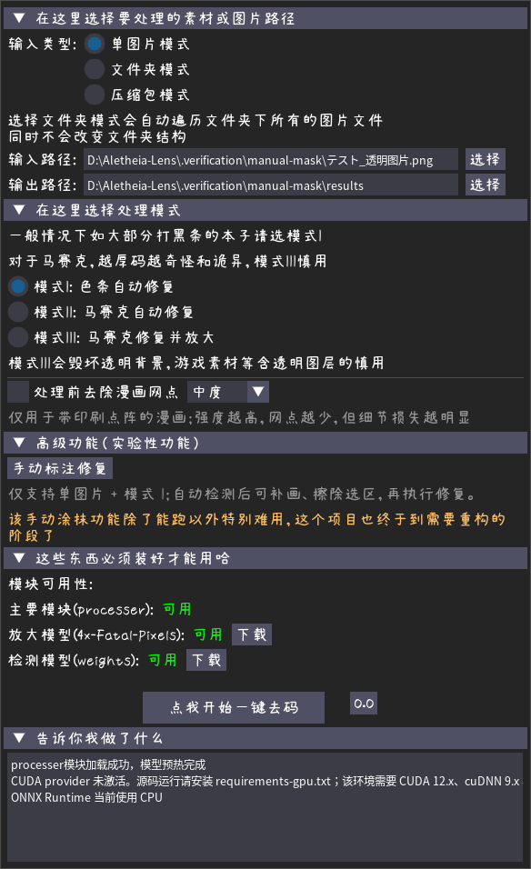
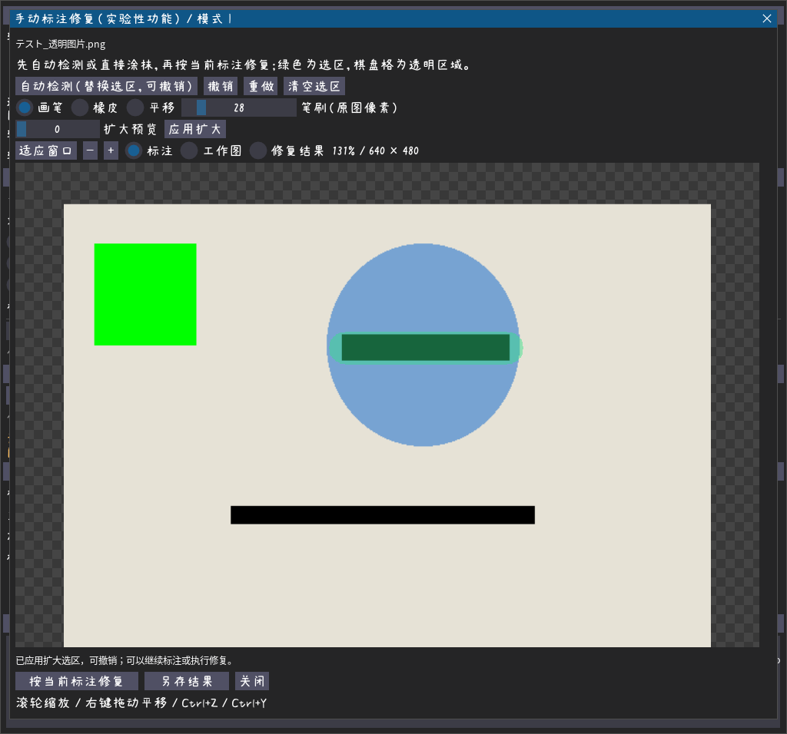
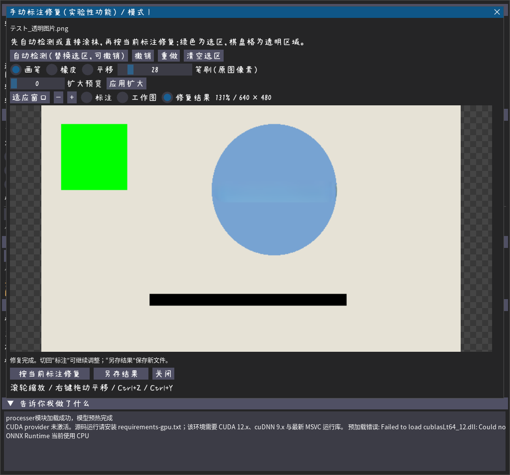

<div align="center">


# Aletheia Lens

[简体中文](README.md) ｜ [English](README.en.md)

[](https://github.com/Cec1c/Aletheia-Lens/releases/latest) [](LICENSE) [](https://github.com/Cec1c/Aletheia-Lens/releases) [](https://github.com/Cec1c/Aletheia-Lens/stargazers)

基于 DeepCreamPy、hent-AI 和 ONNX Runtime 的本地图像修复工具。

自动识别遮挡区域，处理单张图片、整个文件夹或压缩包；提供 Windows 图形界面与解压即用的发行包。

[下载最新版](https://github.com/Cec1c/Aletheia-Lens/releases/latest) ｜ [快速开始](#快速开始) ｜ [使用说明](#使用说明) ｜ [实验性功能](#实验性功能) ｜ [问题反馈](#问题反馈)

</div>

> [!NOTE]
> 仅适用于二次元图片。本文描述当前仓库源码，下载版本支持的功能请以对应 Release 的说明为准。

## 可以用来做什么？

- **处理一批带黑条的图片**：自动识别并修复遮挡区域，减少逐张处理的操作。
- **整理游戏解包素材**：遍历多层文件夹或压缩包，在独立输出目录中保留素材结构。
- **处理扫描漫画**：按需启用去网点预处理，再进行修复。

## 界面预览

<table>
  <tr>
    <td align="center" valign="top">
      <strong>主界面与实验性功能入口</strong><br>
      
    </td>
    <td align="center" valign="top">
      <strong>手动标注编辑器（实验性）</strong><br>
      <br>
      <strong>按选区修复后的结果</strong><br>
      
    </td>
  </tr>
</table>

## 快速开始

### 下载即用

在 [Releases](https://github.com/Cec1c/Aletheia-Lens/releases/latest) 中选择合适的压缩包：

| 发行包 | 适合的设备 | 说明 |
| --- | --- | --- |
| `*_cpu.7z` | 没有合适的 NVIDIA 显卡，或优先选择较小的下载包 | 使用 CPU 推理 |
| `*_cuda12.7z` | 支持 CUDA 12 的 NVIDIA 显卡 | 内置 CUDA 12 / cuDNN 9 运行库，检测与放大优先使用 GPU |

1. 解压压缩包，运行 `Aletheia-Lens.exe`。
2. 等待主要处理模块与模型加载完成。
3. 选择输入类型、输入路径、输出文件夹和修复模式，点击“点我开始一键去码”。

发行包已包含所需模型，无需单独安装 Python 或下载模型。

> [!IMPORTANT]
> CUDA 包中的 DeepCreamPy `bar.onnx` / `mosaic.onnx` 仍固定使用 CPU：这两个旧模型在 CUDA12/cuDNN9 下会产生非有限值。日志会明确显示 ONNX 会话已启用 CUDA、混合状态还是纯 CPU，并说明兼容性策略。

### 从源码运行

当前项目基于 **Python 3.10.11** 构建。其他版本尚未确认兼容性。

```powershell
git clone https://github.com/Cec1c/Aletheia-Lens.git
cd Aletheia-Lens
python -m venv .venv
.\.venv\Scripts\Activate.ps1
pip install -r requirements.txt
```

使用 NVIDIA GPU 时，将最后一行替换为：

```powershell
pip install -r requirements-gpu.txt
```

源码运行 RAR 压缩包还需要安装 [7-Zip](https://www.7-zip.org/)，并确保 `7z.exe` 位于默认安装目录或 `PATH`；打包版已经内置所需文件。

从 [模型 Release](https://github.com/Cec1c/Aletheia-Lens/releases/tag/models-v1) 下载其余模型，放入以下位置：

| 文件路径 | 用途 | 获取方式 |
| --- | --- | --- |
| `models/mrcnn/weights.onnx` | 遮挡区域检测 | 模型 Release |
| `models/esrgan/4x-Fatal-Pixels.onnx` | ESRGAN 放大模型 | 模型 Release |
| `models/esrgan/4x-Fatal-Pixels.onnx.data` | ESRGAN 外部权重 | 模型 Release，与上一文件一起放置 |
| `models/deepcreampy/bar.onnx` | 色条修复 | 已包含在仓库中 |
| `models/deepcreampy/mosaic.onnx` | 马赛克修复 | 已包含在仓库中 |

随后启动：

```powershell
python main.py
```

## 使用说明

### 选择输入

| 输入类型 | 支持内容 | 处理方式 |
| --- | --- | --- |
| 单图片模式 | PNG、JPEG、BMP、TIFF、静态 WebP | 处理指定图片，输出 PNG |
| 文件夹模式 | 多层目录中的受支持图片 | 递归处理，可保留目录结构或平铺输出 |
| 压缩包模式 | ZIP、7Z、RAR | 解压后处理图片，在输出文件夹中保留包内目录结构 |

**文件夹输出目录必须位于输入目录之外。** 输入路径、输出路径和日志支持日文字符。

### 选择修复模式

| 模式 | 功能 | 使用建议 |
| --- | --- | --- |
| 模式 I | 色条自动修复 | 带黑条或色块的图片优先选择此模式 |
| 模式 II | 马赛克自动修复 | 适用于马赛克遮挡，可保留透明通道 |
| 模式 III | 马赛克修复并放大 | 会破坏透明背景；游戏素材慎用，厚重马赛克的效果可能较差 |

修复效果取决于原图与模型能力，遮挡越重，结果越容易失真。

### 去网点预处理

扫描漫画存在密集印刷点阵时，可以勾选“处理前去除漫画网点”。该功能默认关闭，启用后可选择轻度、中度或强度，默认中度。

预处理会在模式 I / II / III 之前执行，并保留 Alpha 透明通道。强度越高，网点通常越少，但线条和纹理也可能损失；没有明显网点的图片建议保持关闭。

### 输出文件

- 单图自动处理输出 `processed_<原文件名>.png`；启用去网点后附加 `.descreen-<强度>`。
- 保留结构的文件夹与压缩包输出到 `after_<名称>_<短哈希>`，图片在完整原文件名后追加 `.processed.png`。
- 平铺输出使用稳定的 SHA-256 文件名，避免不同目录、不同任务中的同名文件互相覆盖。
- 去网点强度会参与输出命名或目录哈希，区分不同处理配置。

<details>
<summary>批量输出与压缩包边界</summary>

保留结构的输出目录按“源完整路径 + 处理配置”生成命名空间；平铺输出按输入根、源相对路径和处理配置生成文件名。处理配置包含修复模式以及启用时的去网点强度。

单个压缩包最多包含 20,000 个成员，解压后总大小最多 20 GiB。解压前会拒绝绝对路径、父目录跳转、Windows 设备名、规范化后冲突的目标，以及符号链接、目录联接和 RAR 重定向，并检查临时目录剩余空间。

</details>

## 实验性功能

> [!WARNING]
> 该手动涂抹功能除了能跑以外特别难用，这个项目也终于到需要重构的阶段了

### 手动标注修复

入口：**单图片模式 + 模式 I → 高级功能（实验性功能）→ 手动标注修复**。

1. 选择图片和输出文件夹。进入编辑器后，可以先“自动检测”，也可以直接用画笔标出漏检区域。
2. 绿色半透明区域表示选区；用橡皮擦除误检，或预览并应用“扩大选区”。自动检测会替换当前选区，支持撤销。
3. 点击“按当前标注修复”，切换工作图与修复结果检查效果。不满意时返回标注继续修改。
4. 点击“另存结果”，保存为 `manual_<原文件名>.png`。重名时自动追加序号，保留原图和已有结果。

| 操作 | 方法 |
| --- | --- |
| 缩放 | 滚轮或加减按钮；“适应窗口”恢复全图视野 |
| 平移 | 右键拖动，或选择“平移”工具 |
| 撤销 / 重做 | 按钮，或 `Ctrl+Z` / `Ctrl+Y` |
| 调整选区 | 画笔、橡皮、笔刷大小、清空、扩大预览及应用 |
| 比较结果 | 切换“标注”“工作图”“修复结果” |

笔刷和扩大范围均按原图像素计算。每次修复都从本次工作图开始，仅替换选区内的颜色并保留透明通道；修改选区后，需要重新修复才能保存。启用去网点时只在打开编辑器时预处理一次，输出名带 `.descreen-<强度>`。

目前仅支持静态单图片和模式 I。编辑器打开后固定本次输入和处理配置；检测或修复时可以关闭窗口，但后台任务仍会完成，结束前不能启动新的处理任务。批量审核、模型替换和整体重构留待后续处理。

## 开发与测试

安装依赖及模型后执行：

```powershell
python -m unittest discover -s tests -v
python main.py --runtime-smoke-test
```

本机图形界面与手动修复流程验证：

```powershell
python tools/verify_manual_mask.py
```

该脚本使用合成图片、程序化交互和真实模型，验证结果与截图写入 `.verification/manual-mask/`。它需要可用的桌面图形环境。

项目使用 PyInstaller 打包，配置见 [main.spec](main.spec)，CPU / CUDA12 构建与发布流程见 [GitHub Actions 配置](.github/workflows/build-and-release.yml)。

## 致谢

| 项目或资源 | 用途 |
| --- | --- |
| [DeepCreamPy](https://github.com/cookieY/DeepCreamPy) | 遮挡区域修复 |
| [hent-AI](https://github.com/natethegreate/hent-AI) | 遮挡区域识别 |
| [4x-Fatal-Pixels](https://openmodeldb.info/models/4x-Fatal-Pixels) | ESRGAN 放大模型，本项目使用其 ONNX 转换版本 |
| [Screentone-Remover](https://github.com/natethegreate/Screentone-Remover) | 去网点预处理思路参考，滤镜代码为本项目独立实现 |
| [deepcreampy-fastapi](https://github.com/fajlkdsjfajdf/deepcreampy-fastapi) | 调用流程参考 |
| [素材集市康康体](http://www.sucaijishi.com/font-37-792-1.html) | 界面中文字体 |
| [Noto Sans CJK JP](https://github.com/notofonts/noto-cjk) | 日文路径及日志字体，SIL Open Font License 1.1 许可证随字体打包 |

## 问题反馈

遇到错误或有功能建议，请提交 [Issue](https://github.com/Cec1c/Aletheia-Lens/issues)。反馈时说明软件版本、CPU / CUDA 版本、输入类型、修复模式和日志，有助于定位问题。

QQ 交流群：**829569018**。

## 许可证

本项目采用 [GNU GPL v3](LICENSE)。所使用模型、字体及第三方组件遵循各自的许可证。
